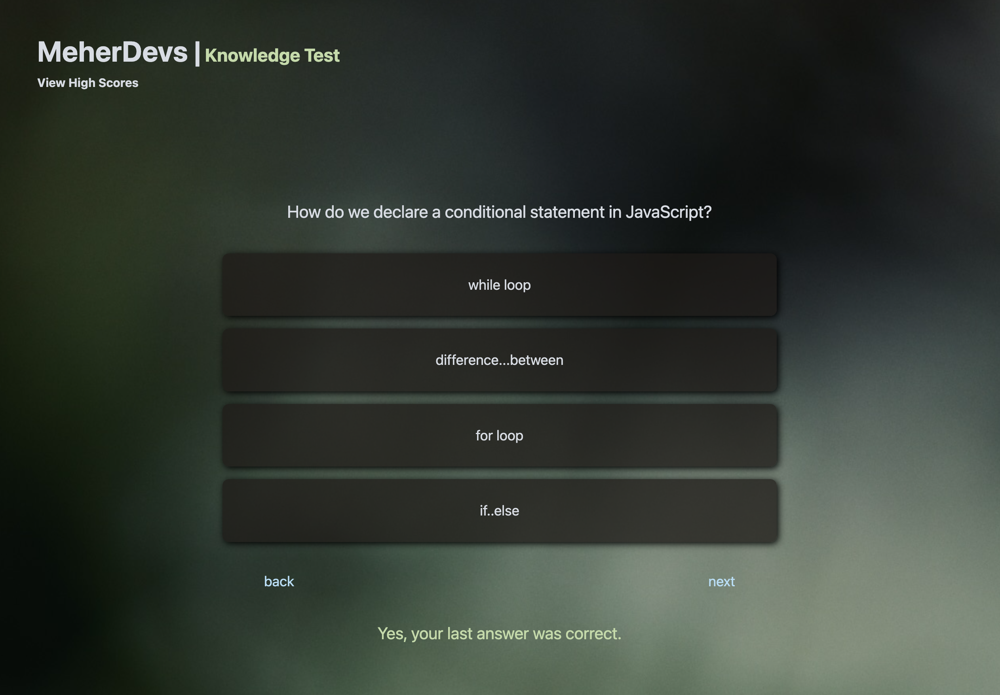

# Knowledge Test

## Link

Live at: https://archonology.github.io/Knowledge-Test/

## Screenshot

## Table of Contents:

#### [Description](#description)

#### [Technology](#technology)

#### [Functionality](#functionality)

#### [Questions](#questions)

## Description

A developer needs to stay sharp on the tech and languages they use to grow and strengthen their coding skills. I created this testing application for my personal testing needs, but anyone is welcome to use it.

## Technology

This test was written in vanilla JavaScript, CSS3, localStorage, and HTML5.

## Functionality

A user can click the start button to begin the test. Questions appear in order, sequentially, though there are back and forward buttons if the user wishes to progress ahead or backward to amend answers (feedback is given for each right and wrong answer as the user progresses). At the end of the test, the results are displayed. A user has the option to enter their name and submit their score to the last high score record, which is displayed at the end of the test and is accessable in the header of the application at any time. Clicking on the last high score data will collapse the records again.

## Questions

If you have questions about this project or any of my other work, please contact me at reed@meherdevs.com. Check out more of my work on Github at [archonology](https://github.com/archonology), or connect with me on [LinkedIn](https://www.linkedin.com/in/reed-meher).

## Kudos

Kudos to the U of MN Bootcamp for the unit self-test questions I borrowed for this app! If there is a copyright problem with that, or such, please reach out and let me know, and I will put this repository on private mode. This app doesn't provide the correct answers unless properly guessed, and the tests I borrowed the questions from are intended for personal review and development with some core full-stack development concepts.
